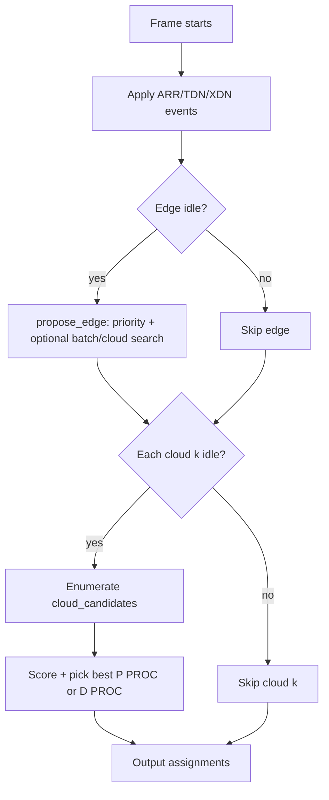

# Codeforces 2251A — Edge–Cloud Collaborative Scheduling

Solution write-up for the interactive scheduling problem. The submission is a single file: [`a_edge_cloud_scheduling.cc`](a_edge_cloud_scheduling.cc), generated from modular headers via [`bundle.sh`](bundle.sh).

---

## 1. Problem in one paragraph

Each request is an LLM inference job: **prefill** (process the prompt) then **decode** (generate output tokens one at a time). Prefill and decode each follow a fixed six-step pipeline split between an **edge** device (one CPU) and **K cloud** servers:

| Step | Where | Phase |
|------|-------|-------|
| P PRE | Edge | Prefill |
| P PROC | Cloud | Prefill (may be split across layers) |
| P POST | Edge | Prefill |
| D PRE | Edge | Decode |
| D PROC | Cloud | Decode |
| D POST | Edge | Decode |

Transfers between edge and cloud share **one uplink** and **one downlink** (FIFO, no overlap on the same direction). At each discrete **frame** (time instant), the judge sends events (arrivals, transfer completions, task completions) and expects up to **K+1** assignments: one edge task plus at most one task per cloud server.

The goal is to maximize a weighted score combining **throughput** (tokens / wall time) and **SLO compliance** (time-to-first-token / time-per-output-token vs targets).

This is an **online** problem: the scheduler sees only past and current state, not future arrivals.

---

## 2. Request lifecycle

```
ARR(rid, lin)
  → P PRE (edge) → [UP] → P PROC (cloud, layers ls..le) → [DOWN] → P POST (edge)
  → D PRE (edge, batched) → [UP] → D PROC (cloud, batched) → [DOWN] → D POST (edge)
  → (repeat D PRE … D POST for each output token until lout tokens)
  → FIN
```

State tracked per request:

- `need` — which step is ready (`PPre`, `PProc`, …)
- `cloud` — assigned cloud for prefill (decode stays on same cloud)
- `next_ls` — next prefill layer index for split P PROC
- `started_decode` — has entered decode at least once (used for prioritization)
- `tokens`, `last_token` — decode progress

Global resources:

- `edge_busy`, `cloud_busy[k]`
- Uplink/downlink queues (`pending_*`, `up_free_at`, `down_free_at`)
- Ready queues per step (`ppre_ready`, `dpre_ready`, …)

---

## 3. Scoring (what we optimize)

From the problem specification (mirrored in `compute_score`):

- **TP** = total output tokens / (last token time − earliest arrival)
- **TDR** = mean time from arrival to prefill completion (first token ready)
- **TPOT** = mean time between consecutive output tokens
- **dist** = √((excess TDR)² + (excess TPOT)²) where excess is vs `slo1`, `slo2`
- **norm_tp** = clamp(TP, tp_base, tp_ub)
- **norm_c** = 1 − dist/dist_base (or 1 iff dist = 0 when dist_base = 0)
- **score** = 1000 × (w_tp × norm_tp + w_c × norm_c)

Tests weight different corners:

| Profile | Typical weights | What matters |
|---------|-----------------|--------------|
| Throughput-heavy | high w_tp | Batch decode, pipeline clouds, admit many prefills |
| Latency / SLO | high w_c | Short TDR/TPOT, don’t starve waiting requests |
| Balanced | w_tp ≈ w_c | Both batching and fairness |

The scheduler does **not** compute the final score online; it uses **surrogate scores** aligned with these metrics when choosing among local options.

---

## 4. Architecture

```
┌─────────────┐     events      ┌──────────┐    assignments    ┌────────┐
│   Judge     │ ──────────────► │ Scheduler│ ────────────────► │ Judge  │
│  (stdin)    │ ◄────────────── │          │                   │        │
└─────────────┘                 └────┬─────┘                   └────────┘
                                       │
                              ┌────────▼────────┐
                              │  World state    │
                              │  + CostModel    │
                              │  + OnlineState  │
                              └────────┬────────┘
                                       │
                              ┌────────▼────────┐
                              │  PolicyEngine   │
                              │  propose()      │
                              └─────────────────┘
```

### Main components

| Component | Role |
|-----------|------|
| `TaskTable` | Piecewise-linear task durations vs batch size (6 step types) |
| `CostModel` | Transfer time, mode detection, batch caps, admit caps |
| `World` | Full mutable simulation state; applies ARR/TDN/XDN/FIN |
| `OnlineState` | EMA of arrival rate for adaptive admission |
| `GroupSearch` | Pick decode batch size (FIFO prefix capped by optimal m) |
| `PolicyEngine` | Per-frame assignment policy (greedy + optional search) |
| `Scheduler` | I/O wrapper; `init()` + `on_frame()` |

---

## 5. Operating modes

At init, `CostModel` classifies the test instance:

```text
slow_link  = unit_transfer > 20ms AND transfer dominates decode compute
tp_heavy   = w_tp >= 0.7
mode       = Slo | Latency | Throughput  (from w_tp, w_c, dist_base)
```

| Mode | Trigger (approx.) | Strategy emphasis |
|------|-------------------|-------------------|
| **Slo** | dist_base ≈ 0 or w_c ≥ 0.9 | Never batch; prioritize SLO; decode fairness |
| **Latency** | w_c high vs w_tp | Small batches; prioritize `started_decode` requests |
| **Throughput** | default | Large batches, pipelining, adaptive admission |

These modes switch batch caps, wait rules, edge priority, and search behavior.

---

## 6. Per-frame algorithm

Each frame:

1. **Apply events** — update `World` from `ARR`, `TDN`, `XDN` lines.
2. **Propose assignments** — `PolicyEngine::propose()`:
   - If edge idle → one edge task (via `propose_edge`)
   - For each idle cloud k → one cloud task (via search or `propose_cloud`)
3. **Output** — count + formatted assignment lines.

### 6.1 Edge policy (`propose_edge`)

Fixed priority structure (preserves correctness on latency tests):

1. **P POST** — always first if any prefill waiting for post-processing.
2. Collect ready **D POST**, **P PRE**, **D PRE** queues.
3. Form decode groups via `decode_group()` (batch + reorder).
4. Apply **wait** rules (`should_wait`) on D POST when building a larger batch is still worth it on slow links.
5. **Prefill wave** — on tp-heavy + slow link, hold small D PRE batches while prefills are in flight.
6. **Admission control** — limit concurrent prefills (`effective_admit_cap`, `effective_admit_every`).
7. Choose among D POST / D PRE / P PRE using mode-specific rules:
   - **Throughput-heavy:** prefill waves, decode streak–gated admission
   - **Latency/SLO:** compare `edge_utility()` of competing actions
   - **Default fallback chain**

When `frame_search` is enabled, edge still follows this priority, but individual emits are refined:

- **`best_ppre_cloud(rid)`** — try top 4 least-loaded clouds, pick best surrogate score.
- **`best_decode_group(...)`** — on tp-heavy slow links, try smaller FIFO-prefix batches for D PRE / D POST.

### 6.2 Cloud policy (`propose_cloud` / frame search)

For each idle cloud server:

**Without search (greedy):**

- Prefer **P PROC** if decode streak on that cloud is high, or prefill backlog exists on slow links.
- Else run **D PROC** batch if decode ready.
- **P PROC** layer range `[ls, le)` from `pproc_le()` — full layers unless tp-heavy and competing with decode.

**With `frame_search` (`propose_search`):**

1. Edge: greedy as above.
2. Cloud: enumerate `cloud_candidates(k)`, score each with `score_cloud_action`, take argmax.

Candidates include:

- **P PROC** — several `le` values (layer splits) when tp-heavy; full layers only otherwise.
- **D PROC** — default optimal group + smaller FIFO-prefix batches on tp-heavy slow links.

### 6.3 Decode grouping (`decode_group`)

Valid decode batches must be a **FIFO prefix** of the ready queue (after filtering), then optionally:

1. **Same-cloud filter** (D PRE, slow link, K>1) — keep largest cloud cohort (≥2).
2. **Reorder** — `stable_partition` so `started_decode` requests come first (latency/SLO).
3. **WFQ-style fairness** (optional `decode_fairness`) — sort by token count for latency mode.
4. **Cap** — `GroupSearch::select` trims to `group_cap(m, step)`.

`group_cap` is precomputed offline in `CostModel::precompute()`:

- For each step, find batch size m maximizing throughput `m / cycle(m)` (amortized transfer + compute).
- For D PRE in throughput mode, also consider **pipeline** decode across K clouds (`decode_roundtrip`).

---

## 7. Online adaptation

No lookahead; these mechanisms react to observed pressure:

### 7.1 Arrival EMA (`OnlineState`)

Exponential moving average of inter-arrival rate. Used to raise admit cap under burst load in throughput mode.

### 7.2 SLO pressure

```text
pressure_tdr  = max(0, mean_TDR/slo1 − 0.75)
pressure_tpot = max(0, mean_TPOT/slo2 − 0.75)
pressure      = pressure_tdr + pressure_tpot
```

Effects:

- Increases weight on latency in `edge_utility`
- Tightens `effective_admit_every` (admit prefills more aggressively when healthy)
- Extends max batch wait via `batch_wait_age_frac × slo2 × (1 + pressure)`

### 7.3 Batch waiting (`should_wait`)

On slow links in throughput mode: if a decode batch is below target size **and** more work is coming **and** oldest waiting token is younger than the adaptive deadline → **wait** (return no D POST this frame) to form a larger batch.

### 7.4 Cloud load balancing (`pick_cloud` / `ranked_clouds`)

Score = prefill count × weight + sum of input lengths + request count + transfer penalty if uplink congested.

Frame search evaluates the top 4 clouds for P PRE.

---

## 8. Frame search (exhaustive local search)

Because many tests use ≪1s of a multi-second limit, we spend CPU on **bounded enumeration** each frame instead of full-schedule optimization (infeasible online).

| Search space | When | Candidates |
|--------------|------|------------|
| P PRE cloud | K > 1, frame_search | ≤ 4 clouds |
| D PRE / D POST batch | tp-heavy + slow link | FIFO prefixes × `batch_caps` |
| P PROC layers | tp-heavy | split / half / +1 / full |
| D PROC batch | tp-heavy + slow link | FIFO prefixes × `batch_caps` |

`batch_caps(n, step)` generates ~10–15 sizes: 1, powers of 2, group_cap, fractions thereof.

### Surrogate scoring

**Edge (`score_edge_action`):**

- P POST → huge priority (must drain)
- D POST / D PRE → tokens/cycle + TPOT gap bonus + batch log bonus (throughput)
- P PRE → age/slo1 − cloud load − over-cap penalty + prefill-wave boost

**Cloud (`score_cloud_action`):**

- D PROC → tokens/cycle − penalty if starving prefill on same cloud
- P PROC → age/slo1 + 1/(layer_time) + bonus if decode streak ≥ 2 ( unblock decode)

Search picks the candidate maximizing surrogate score. Edge **action type** stays greedy; search only tunes parameters within the chosen action.

---

## 9. Init-time auto-tuning (`auto_tune`)

Before the first frame, `tune_policy(cfg)` evaluates **96 policy variants** (`policy_variant(v)`) with an **analytic proxy** (`analytic_policy_score`):

- Estimates batch vs single-request throughput and latency cycles from the task table.
- Adds bonuses for wait-to-batch on slow links when w_tp is high (and vice versa for w_c).
- Picks the variant with highest proxy score; disables `auto_tune` afterward to avoid re-tuning.

This is cheap (no simulation) and adapts knobs like `slo_pressure_gain`, `batch_wait_age_frac`, `cloud_xfer_weight`, `prefill_wave_cap`, etc., to the instance’s table and weights.

---

## 10. Key design decisions

### Why not MIP / simulated annealing / full DP?

The judge is **interactive** — decisions must be made in milliseconds per frame with no knowledge of future arrivals. Full schedule optimization does not transfer; we use **greedy + local search**, similar in spirit to EdgeOPT-style online schedulers from edge-inference literature.

### Why greedy edge priority + cloud search?

Letting search pick among D POST vs D PRE vs P PRE directly ** broke** balanced/latency tests (score 885 vs 1000): throughput surrogate favored wrong action ordering. Cloud-only search keeps correctness while still optimizing batch sizes and layer splits.

### Why FIFO prefix before sub-batching?

Trimming a batch **after** globally reordering decode queues produced **invalid decode groups** (malformed rids). Sub-batches must be prefixes of the ready queue, then grouped.

### Why three mode classes?

Problem weights span three qualitatively different objectives. A single policy cannot be optimal everywhere; mode detection switches batch caps, wait behavior, and split rules.

---

## 11. Interactive protocol (I/O)

**Init (stdin):**

```text
K s latency_ms bandwidth_gbps bytes_per_token num_layers
slo1 slo2 tp_ub tp_base dist_base w_tp w_c
n_rows
(batch_size  t_ppre t_pproc t_ppost t_dpre t_dproc t_dpost) × n_rows
```

**Loop until `END`:**

```text
<t>                    # frame time
<e>                    # number of events
<event line> × e       # ARR / TDN / XDN / FIN
```

**Output:**

```text
<a>                    # number of assignments (0 .. K+1)
<assignment line> × a  # e.g. "E D PRE -1 3 1 4 7"
```

Assignment format is built by `Assignment::format()`.

---

## 12. File map

| File | Purpose |
|------|---------|
| `task_table.hh` | Duration lookup, transfer formula, score computation |
| `scheduler.hh` | World, policies, search, main logic |
| `simulator.hh` | Offline replay harness (local testing) |
| `stress.cc` | Regression scenarios |
| `tune.cc` | Offline grid search over policy variants |
| `bundle.sh` | Produces `a_edge_cloud_scheduling.cc` |
| `a_edge_cloud_scheduling.cc` | **Codeforces submission** |
| `../../tests/edge_cloud_test.cc` | Google Test coverage of tables, protocol, and policies |

Regenerate submission after changes:

```bash
cd codeforces/cf2251 && ./bundle.sh
```

---

## 13. Complexity

Per frame:

- Event processing: O(events + requests touched)
- Edge propose: O(R log R) for queue collects and grouping (R = ready requests)
- Cloud search: O(K × C × R) with small C (≤ ~15 candidates per cloud)
- Memory: O(requests + queue sizes)

Overall comfortably within typical limits (≪ 1s even on large instances).

---

## 14. Summary flowchart



---

## 15. References and inspiration

- **Edge–cloud LLM inference** — split prefill/decode across edge and cloud with bandwidth constraints.
- **EdgeOPT / adaptive batching** — SLO-aware batch wait thresholds and admission control (implemented via `OnlineState`, `should_wait`, SLO pressure).
- **WFQ / fairness** — optional decode fairness by token count in latency mode.
- **Amortized batch sizing** — precomputed `best_pre_[step][m]` = argmax throughput for batch size m.

The implementation prioritizes **robust online behavior** over provably optimal offline schedules, which matches the interactive judge model for this contest.
